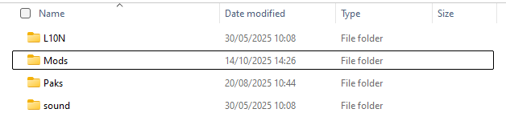
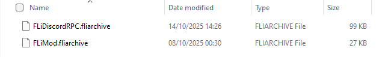

# Addings mods
::: tip
If you're interested in creating your own mods for **Fantasy Life I** there's [check this](../api-documentation/creating-mod.md)
:::

### Create the Mods folder
Inside your game installation directory navigate to `Game/Contents/`.
If there isn't already a folder named `Mods`, create one manually.

Your structure should look like this:

### Add your mods 
Place your `.fliarchive` mod file inside the `Mods` folder:

And that's it, the mod loader will automatically detect any valid `.fliarchive` files placed in this directory when you launch the game! 