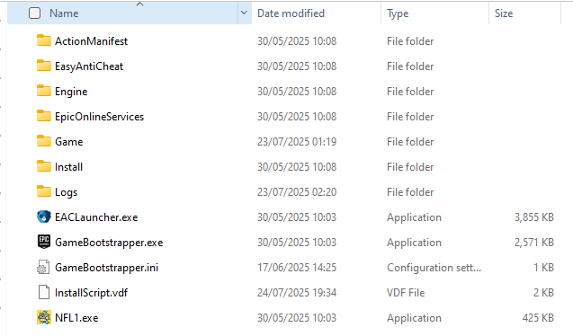
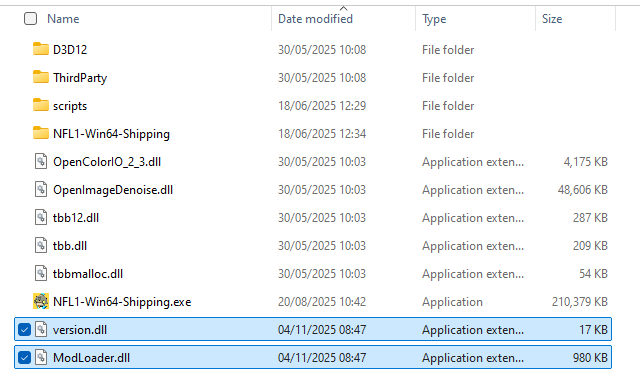

# Quick setup

::: danger
   The mod loader is only compatible with officially supported, up-to-date game versions. Using unofficial or cracked copies may prevent it from working.

  To run the mod loader, you **must disable anti-cheat software** as it can prevent the loader from initializing.

  **HOWEVER**: 
  Disabling anti-cheat does NOT permit cheating. You are still expected to follow the game's **Terms of Service**, **EULA**, and **server rules**. The mod authors are not responsible for penalties, bans, or other consequences resulting from rule violations.
:::

### Require
- A copy of [Fantasy Life I](https://store.steampowered.com/app/2993780/FANTASY_LIFE_i_The_Girl_Who_Steals_Time/) on PC

### Find your game directory
To continue, you may need to locate the game installation directory. On **Steam**, this is easy: **right-click** the game in your library, then go to `Manage` -> `Browse local files`.

You should now see a folder structure like this:

Now u should find something like this:

Go inside `Game/Binaries/Win64`

Next, download **ModLoader.dll** and **version.dll** from our [Github release](https://github.com/ReDevCafe/FantasyLifeI-API/releases/latest) and place them inside the `Win64` folder.

